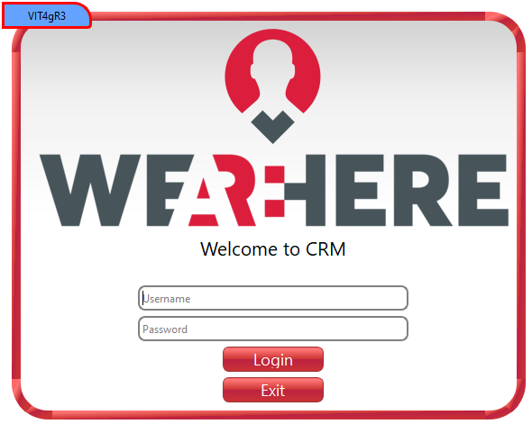
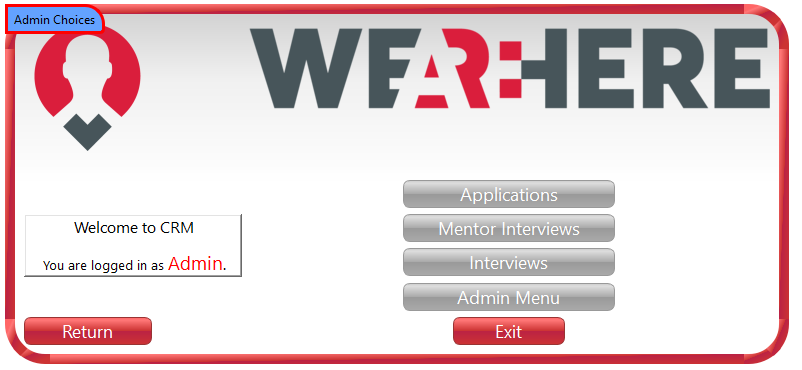
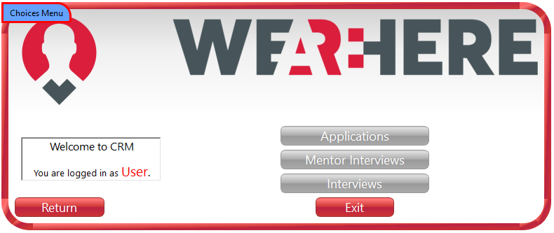
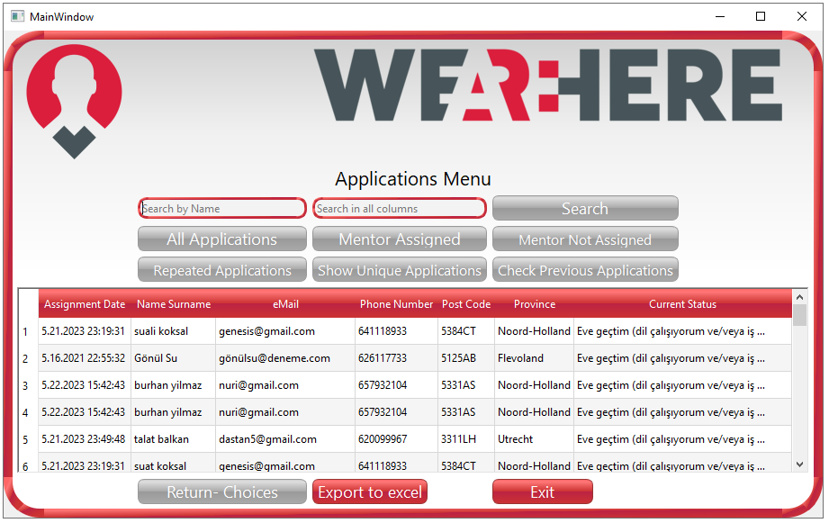
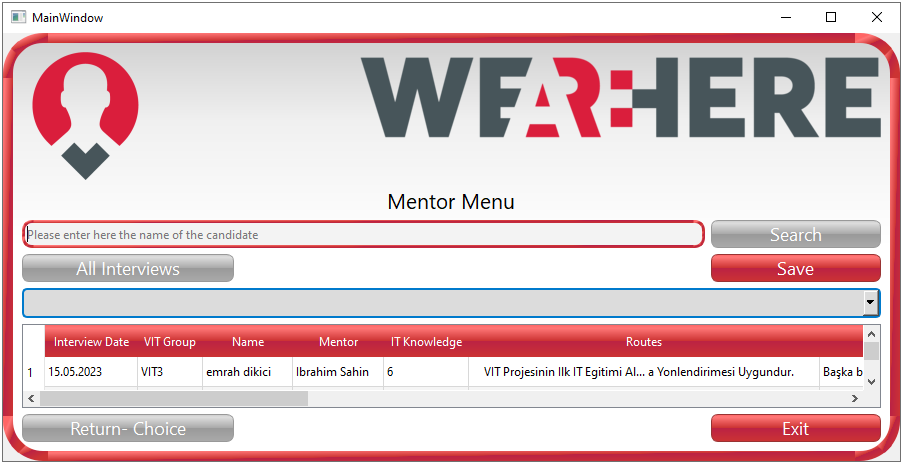
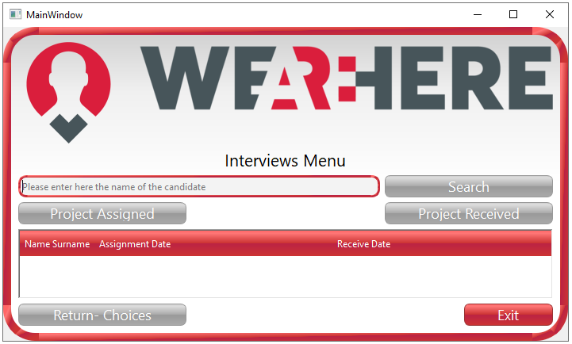
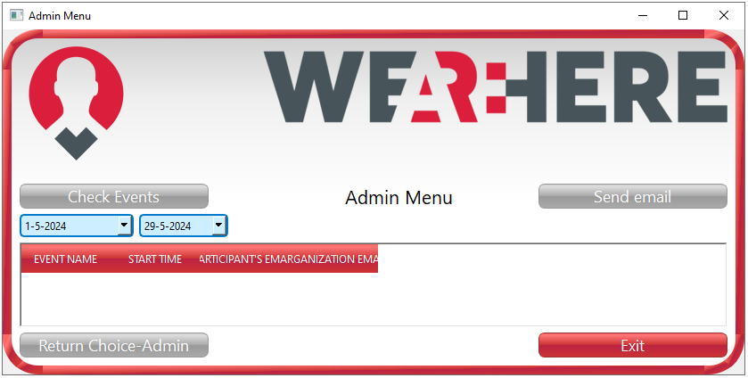

# CRM_v4.3 Project

## Introduction

This project is a CRM application that allows users and administrators
to manage applications and interviews. The application provides various
modules covering login, application management, mentor meetings, and
interviews with a user-friendly interface.

## Installation Instructions

1\. Clone this project:

\`\`\`bash

git clone https://github.com/werhereitacademy/VIT4-Python-Module-Week7.git

1\. Install the required dependencies:

pip install -r requirements.txt

2\. Run the application:

Python main.py

## Usage Instructions

### Login Window

#### Username and Password

• Access is granted to users whose username and password are saved by
the main Gmail account user of Google Drive.

• If the user\'s access permission is Admin, they are directed to the
Choices - Admin menu; if the access permission is User, they are
directed to the Choices menu.

• A customized login page is created for the application.

• There are two separate input elements for the username and password.

• There is a login button that will react to these two pieces of
information.

• There is a warning message that will indicate whether the login was
successful or not when the button is clicked.

• Optionally, an exit button can be included to close the application
window.

### Choices

#### A) Choices Admin

• Applications: The Applications button directs the admin to the initial
applications window.

• Mentor Interviews: The Mentor interviews button directs the admin to
the mentor window.

• Interviews: The Interviews button directs the admin to the interviews
window.

• Admin Menu: The Admin button directs the admin to the Admin window.

#### B) Choices

• Applications: The Applications button directs the user to the initial
applications window.

• Mentor Interviews: The Mentor Interviews button directs the user to
the mentor window.

• Interviews: The Interviews button directs the user to the interviews
window.

### Applications

• Search: Can search for names within the text entered in the text line
(e.g., entering \'Me\' will bring all names starting with \'Me\'
recorded in the drive).

• All Applications: When the All Applications button is clicked, all
applications recorded in the applications file on the drive are
displayed on the screen.

• Assigned Mentor Interviews: When the Assigned Mentor Interviews button
is clicked, individuals who have been assigned a mentor meeting after
applying are displayed on the screen.

• Mentor Not Assigned Interviews: When the Mentor Not Assigned
Interviews button is clicked, individuals who have not yet been assigned
a mentor after applying are displayed on the screen.

• Repeated Applications Button: When the Repeated Applications Button is
clicked, individuals who have registered with the same name and email
address (only repeated candidates) in the applications file on the drive
are displayed on the screen.

• Previous VIT Control Button: When the Previous VIT button is clicked,
all candidates who are common in the VIT1, VIT2, and Applications files
or in any combination are displayed on the screen (to see if a candidate
has applied to more than one VIT).

• Show Unique Applications: When the Show Unique Applications button is
clicked, records in the applications file are filtered and displayed
without duplicate records (if a name is registered more than once, this
record is displayed only once).

• Return to Choices Screen: When the Return to Choices Screen button is
clicked, the user returns to the Choices screen.

### Mentor Menu

• Search: Can search for names within the text entered in the text line.

• All Interviews: When the All Interviews button is clicked, all
interviews recorded in the Mentor file are displayed on the screen.

• Return to Choices Screen: When the Return to Choices Screen button is
clicked, the user returns to the Choices screen.

### Interviews

• Search: Can search for names within the text entered in the text line.

• Project Assigned: When this button is clicked, candidates whose
projects have been sent and are recorded in the Interviews file are
displayed on the screen.

• Project Received: When this button is clicked, candidates whose
projects have been received and are recorded in the Interviews file are
displayed on the screen.

• Return to Choices Screen: When the Return to Choices Screen button is
clicked, the user returns to the Choices screen.

### Admin Menu

• Check Events Button: This button displays the events recorded on
Google Drive.

• Send Email Button: After fetching the events from the calendar, this
button allows sending automatic emails to the email addresses registered
for the events.

• Return to Choices-Admin Screen Button: When this button is clicked,
the admin returns to the Choices-Admin screen.

File and Folder Structure

• main.py: Main application file.

• requirements.txt: File listing project dependencies.

• README.md: Documentation file providing information about the project.

• img/: Folder containing project images.

Contributing

If you would like to contribute, please create a pull request or open an
issue.

License

This project is licensed under the MIT License. See the LICENSE file for
more information.

Authors and Acknowledgments

• Username: Usemedim, Muserrefer, YasinSyc, TDakak

• Helper Name: buyukakcali

Version History

• v1.0.0: Initial release.

# Minimum System Requirements

## Operating System:
- Windows 7 or later
- macOS 10.12 (Sierra) or later
- Linux (any modern distribution)

## Processor:
- A multi-core processor (Intel i3 or equivalent)

## Memory (RAM):
- At least 4 GB of RAM (8 GB recommended for better performance, especially if dealing with large datasets in pandas)

## Storage:
- At least 500 MB of free disk space for Python, libraries, and application data
- Additional space as needed for storing datasets and temporary files
